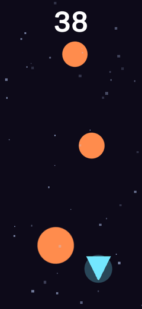

# mobile-arcade

Small, original **one-thumb "time-killer" games**, built in **Unity 6** and playable right in the
browser (WebGL). Each is a tight hyper-casual loop — simple, addictive, complete-feeling — not a
big game. Original art and audio, all generated procedurally (no imported assets).

**▶ Play them all: https://arcsymer.github.io/mobile-arcade/**

> Honest framing: these are original **hyper-casual prototypes** built to demonstrate small,
> polished mobile loops — not commercial releases. Every clip below is real gameplay.

## Games

| Game | Mechanic | Status | Play |
|------|----------|--------|------|
| **STARDODGE** | endless dodge — weave through falling meteors | ✅ Live | [play](https://arcsymer.github.io/mobile-arcade/web/stardodge/) |
| *(game 2)* | tap-timing | ⏳ in progress | — |
| *(game 3)* | merge / grow | ⏳ in progress | — |
| *(game 4)* | reflex / whack | ⏳ in progress | — |

### STARDODGE


Steer a glowing craft left/right (hold/drag anywhere) to weave through meteors that fall faster
and thicker the longer you survive. Score by distance; beat your best. Tap to start, tap to retry.
Juice: screen shake + a particle burst on impact, a starfield, synthesised blips. There's also an
**attract mode** (`?demo=1`) where the craft auto-pilots and dodges on its own.

## How they're built

Each game is a **code-only Unity project** — an editor script builds the scene from code, and a
single `Game.cs` constructs everything at runtime:
- **Sprites** are drawn procedurally into `Texture2D` (circles / triangles / squares with soft
  edges) — zero imported image files.
- **Sound** is synthesised in code (`AudioClip.Create` — sine tones + noise bursts).
- **HUD** is IMGUI (no scene UI or font assets); input is mouse **and** touch; layout is portrait
  and fills the viewport responsively.
- WebGL builds ship uncompressed so they load on any static host (GitHub Pages) with no server
  config. The Unity player runtime (`web/<game>/Build/*.wasm`) is committed so Pages can serve it.

## Build a game

```
Unity -batchmode -nographics -projectPath <game> -buildTarget WebGL \
      -executeMethod BuildTool.BuildWebGL -logFile -
```
Then copy `Builds/WebGL/Build/` into `web/<game>/` (the served folder keeps a small responsive
`index.html`). See [HUMAN_TODO.md](HUMAN_TODO.md) for the Android-module note and build tips, and
[CREDITS.md](CREDITS.md) for the all-procedural asset statement.

## Targets

- **WebGL** — live on GitHub Pages (primary).
- **Windows** — standalone build supported (`BuildTool.BuildWindows`).
- **Android** — needs the Unity Android module (not installed here) → [HUMAN_TODO](HUMAN_TODO.md).

---
Built by [@arcsymer](https://github.com/arcsymer).
